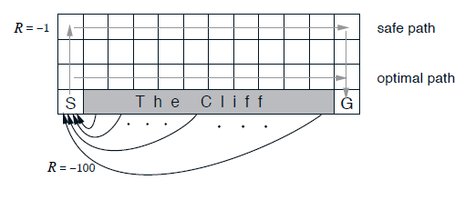

CliffWalking
===
A simple platform to play with reinforcement learning AI. 
This problem (cliff walking) problem is from *Reinforcement Learning: An Introduction (2nd edition)*. The draft of this 
book could be downloaded from the [author's homepage](https://webdocs.cs.ualberta.ca/~sutton/).

This project is simply a test platform for education and fun. I hope you would like it.
## Description

The agent should go from block *S* to block *G*. If the agent fall into 
the cliff, it will get a return of -500. Otherwise it will get a return of -1 
each step until it gets to the destination.

## Reinforcement AI List
* On-policy Monte Carlo epsilon-greedy AI (MonteCarloAI.java)
* Sarsa: an on-policy TD control algorithm with epsilon-greedy policy. (SarsaAI.java)
* Human Interface(Human.java)

## TODO List
* Q-learning AI
* GUI for show the behavior of AIs.

## License
Please check LICENSE for more details.
